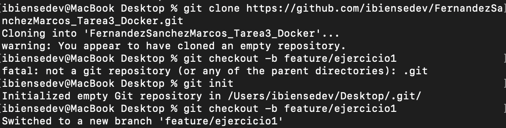
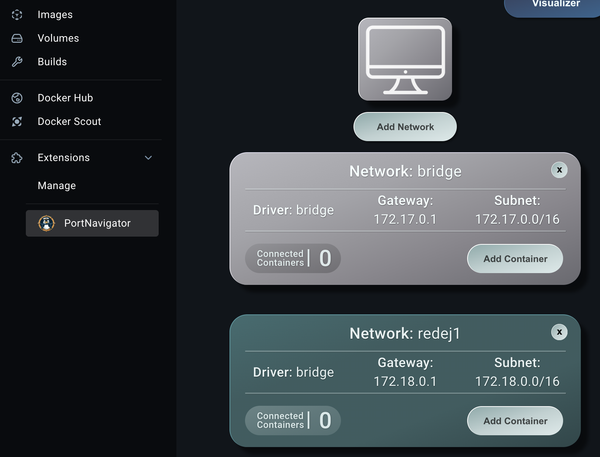
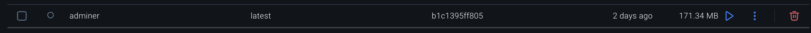
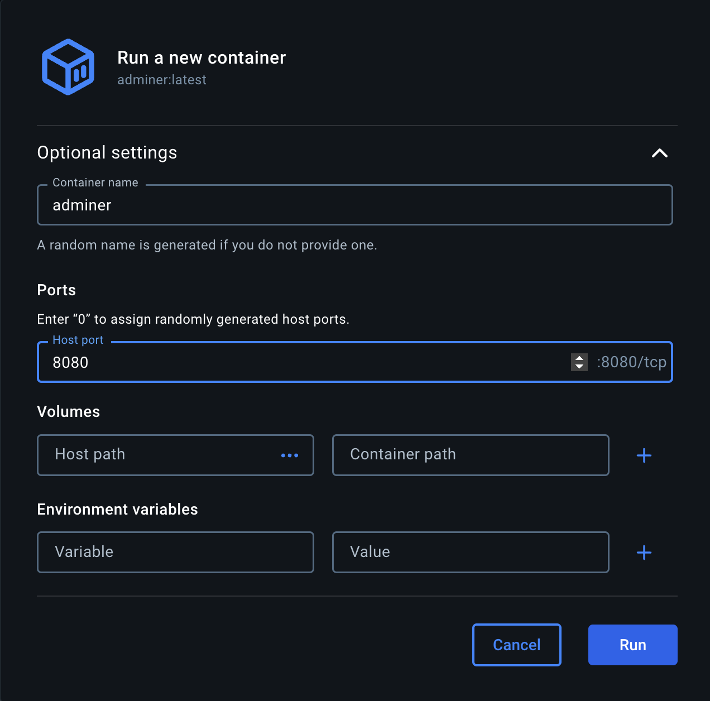
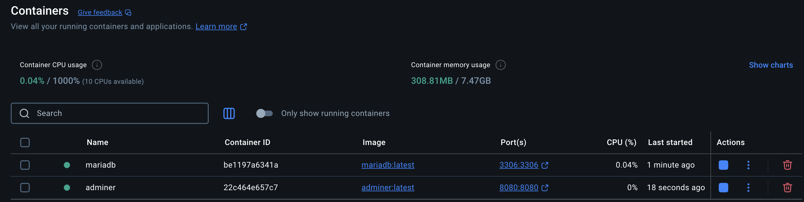
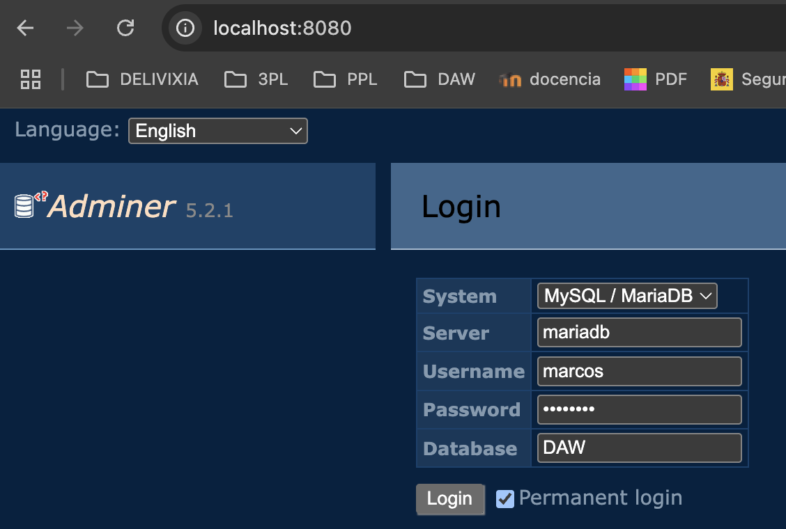
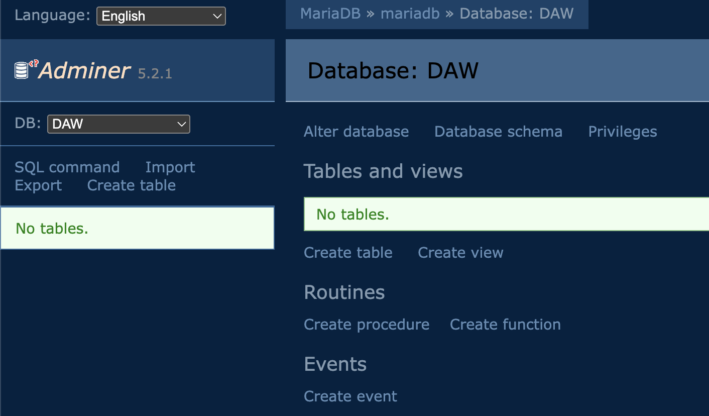
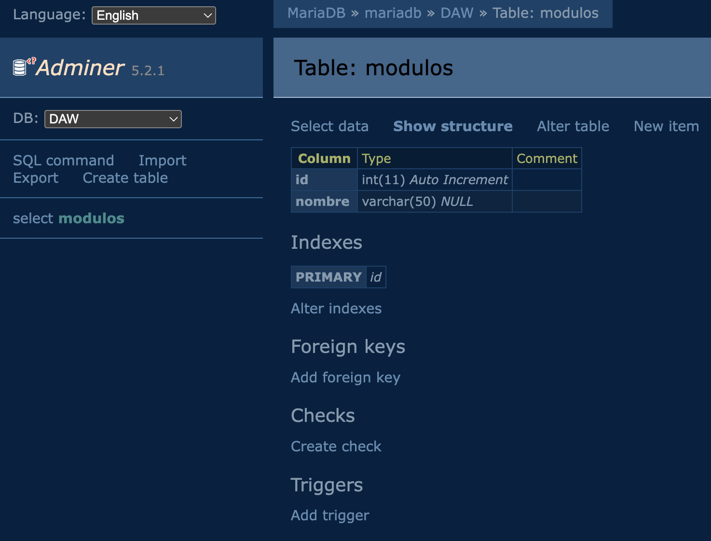
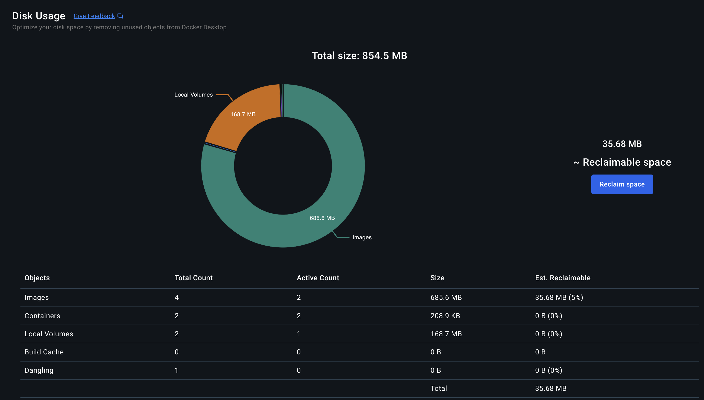

# Documentación de la Tarea Evaluable Docker - 2EV - DAW Distancia - CIFP Sect. Industrial y Servicios - La Laboral

# Marcos Fernández Sánchez

# Ejercicio 1 - Contenedores en red y Docker

## Índice
  - [Creación de repositorio de Github y rama](#1-Creación-de-repositorio-de-Github-y-rama)
  - [Contenedores en red y Docker](#2-Contenedores-en-red-y-Docker)

## 1. Creación de repositorio de Github y rama
Se procede a crear el repositorio de Github que se utilizará para realizar la tarea evaluable de Docker y la rama donde se resolverá el ejercicio.




## 2. Contenedores en red y Docker

### 2.1. Crear una red bridge redej1.
Se instala la extensión PortNavigator que permite gestionar las redes en Docker Desktop y se crea una red bridge.



### 2.2. Crear un contenedor con una imagen de mariaDB que estará en la red redej1.
Se descarga la imagen de mariaDB, se crea el contenedor a partir de la imagen y se conecta a la red creada anteriormente. Se crea también el script SQL.


```sql
CREATE TABLE modulos (
    id INT AUTO_INCREMENT PRIMARY KEY,
    nombre VARCHAR(50)
);

INSERT INTO modulos (nombre) VALUES
('Despliegue'),
('Entornos'),
('Servicios'),
('Aplicaciones Web');
```

### 2.3. Crear un contenedor con Adminer o con phpMyAdmin que se pueda conectar al contenedor de la BD.
Se descarga la imagen de adminer y se crea el contenedor, conectados a la misma red que mariadb.







### 2.4. Desde la interfaz gráfica elegida, conéctate a la BD con tu usuario personal, ejecuta el script con los datos de los módulos y muestra la BD y la tabla creados.
Me conecto a la BD de mariaDB a partir de la interfaz gráfica de Adminer. Se ejecuta el script SQL y se crea la tabla modulos correctamente.








### 2.5. Instala la extensión Disk Usage, muestra el espacio ocupado, borra algo...
Se instala la extensión Disk Usage para Docker Desktop, se borra una imagen y obviamente el espacio varia.

