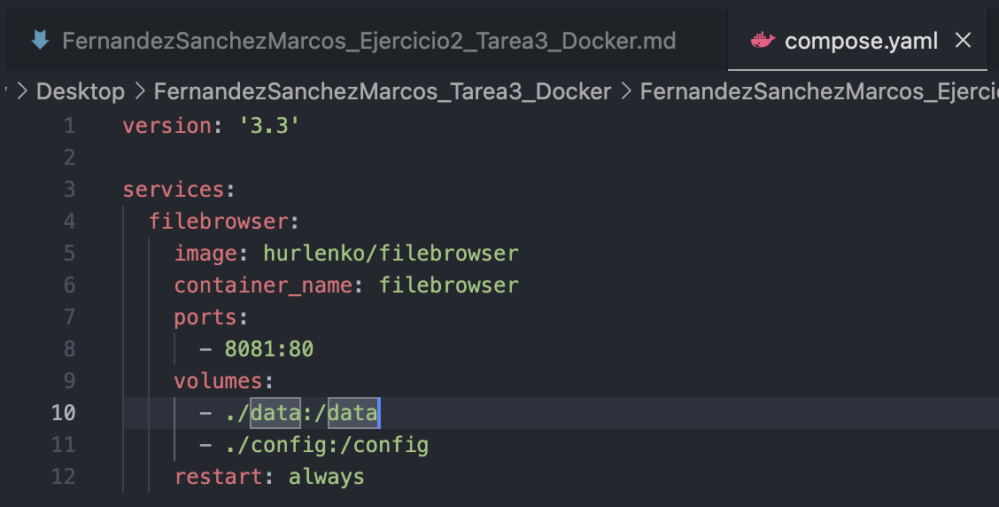
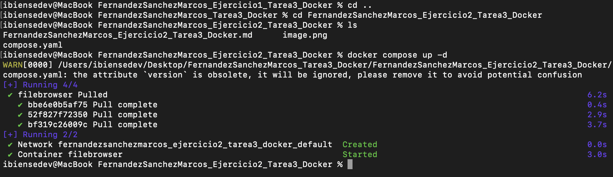
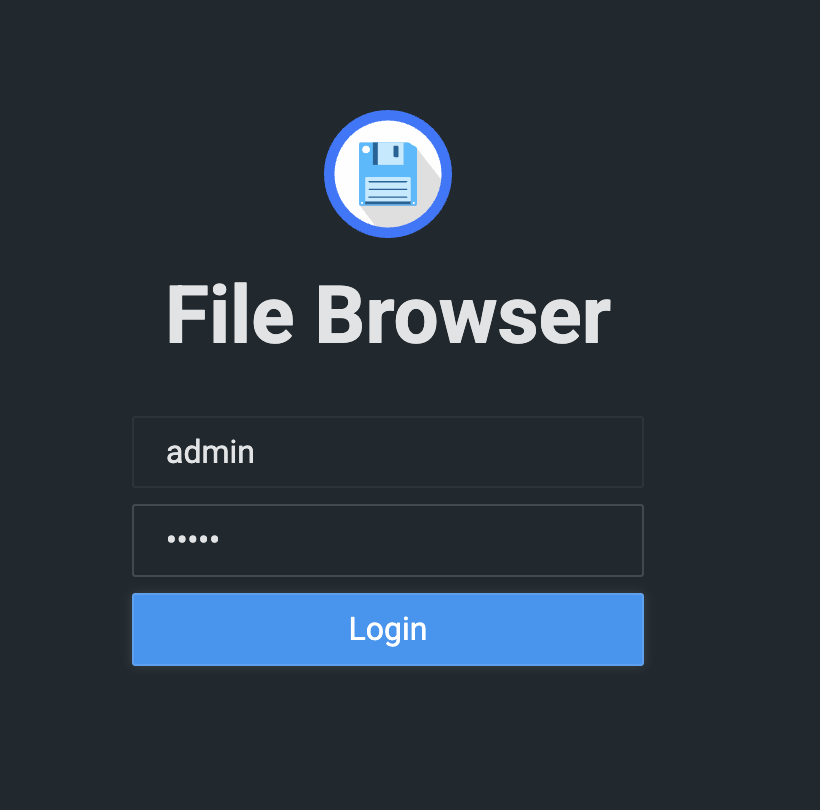
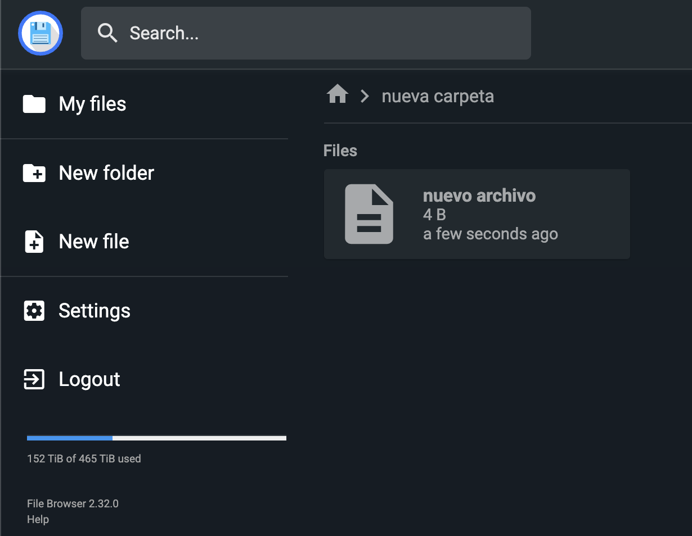

# Documentación de la Tarea Evaluable Docker - 2EV - DAW Distancia - CIFP Sect. Industrial y Servicios - La Laboral

# Marcos Fernández Sánchez

# Ejercicio 2 - Docker Compose

## Índice
  - [Fichero Docker Compose](#1-Fichero-Docker-Compose)

## 1. Creación de fichero Docker Compose
Se crea el fichero .yaml y se crea el contenedor usando Docker Compose para poder usar File Browser.

FileBrowser es una aplicación web que te permite navegar, subir, descargar y gestionar archivos desde el navegador, como si fuera un “explorador de archivos online”.

Se crea una nueva carpeta y un nuevo fichero.

