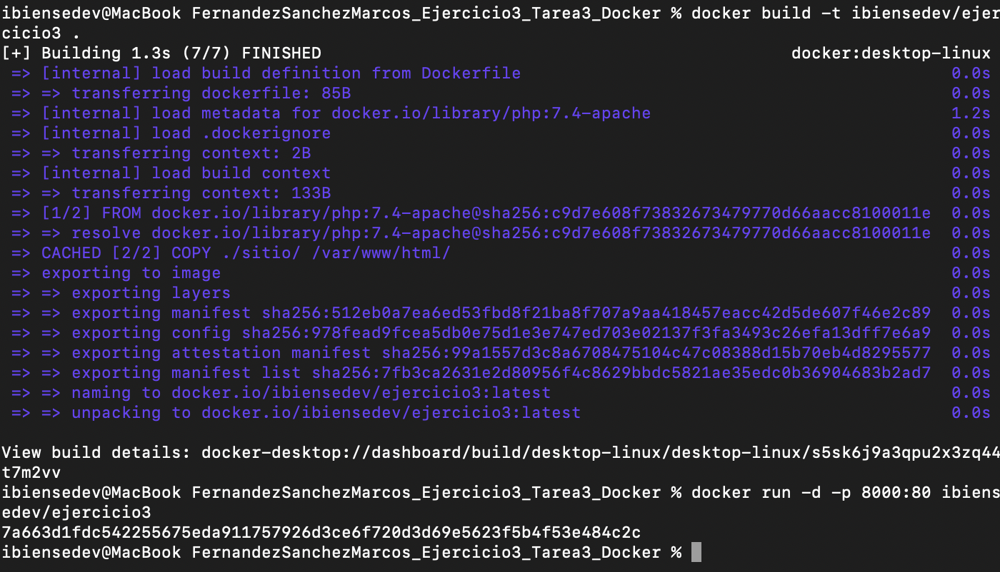
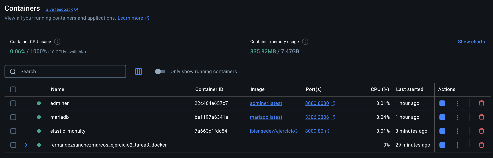

# Documentación de la Tarea Evaluable Docker - 2EV - DAW Distancia - CIFP Sect. Industrial y Servicios - La Laboral

# Marcos Fernández Sánchez

# Ejercicio 3 -  Imagen con Dockerfile - Aplicación web

## Índice
  - [Imagen Dockerfile](#1-Imagen-Dockerfile)

## 1. Imagen DockerFile - Aplicación web

Se crea la estructura de archivos para el sitio, el Dockerfile, se crea la imagen en el hub de Docker, se ejecuta el contenedor con la imagen creada y se sube la imagen al Docker Hub.

```bash
docker build -t tu_usuario_dockerhub/ejercicio3 .
```




